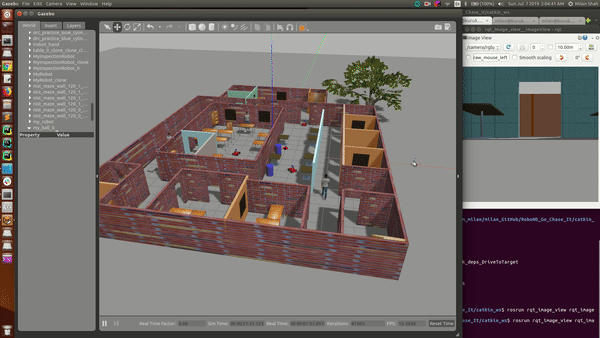

[](https://www.udacity.com/robotics)

# Udacity Nanodegree: Robotics Software Engineer

## Project 02: Go Chase It!

<p align="center">
    
</p>

### Directory Structure
```
.Go_Chase_It                            # Project 02: Go Chase It!
├── ball_chaser                         # ball_chaser package
│   ├── include
│   │   └── ball_chaser
│   ├── launch                          # launch folder for launch files
│   │   └── ball_chaser.launch
│   ├── src                             # source folder for C++ scripts
│   │   ├── drive_bot.cpp
│   │   └── process_image.cpp
│   ├── srv                             # service folder for ROS Services
│   │   └── DriveToTarget.srv
│   ├── CMakeLists.txt                  # compiler instructions
│   └── package.xml                     # package info
├── my_robot
│   ├── launch                          # launch folder for launch files
│   │   ├── robot_description.launch
│   │   └── world.launch
│   ├── meshes                          # meshes folder for sensors
│   │   └── hokuyo.dae
│   ├── urdf                            # urdf folder for xacro files
│   │   ├── my_robot.gazebo
│   │   └── my_robot.xacro
│   ├── worlds                          # world folder for world files
│   │   ├── empty.world
│   │   └── MyWorld.world
│   ├── CMakeLists.txt                  # compiler instructions
│   └── package.xml                     # package info
└── CMakeLists.txt -> /opt/ros/kinetic/share/catkin/cmake/toplevel.cmake

```

### How to run

#### 1. First of all, clone this repo:
```
git clone https://github.com/milan-r-shah/RoboND_Go_Chase_It.git
```

#### 2. Launch the robot inside your world
This can be done by launching ```world.launch``` file:
```
$ cd <directory_where_you_have_cloned_the_repo>/RoboND_Go_Chase_It/catkin_ws/
$ catkin_make
$ source devel/setup.bash
$ roslaunch my_robot world.launch
```

#### 3. Run ``` drive_bot ``` and ``` process_image ```
This can be done by launching ```ball_chaser.launch``` file:
```
$ cd <directory_where_you_have_cloned_the_repo>/RoboND_Go_Chase_It/catkin_ws/
$ source devel/setup.bash
$ roslaunch ball_chaser ball_chaser.launch
```

#### 4. Visualize
To visualize the robot’s camera images, you can subscribe to camera RGB image topic from RViz. Or you can run the rqt_image_view node:
```
$ cd <directory_where_you_have_cloned_the_repo>/RoboND_Go_Chase_It/catkin_ws/
$ source devel/setup.bash
$ rosrun rqt_image_view rqt_image_view
```