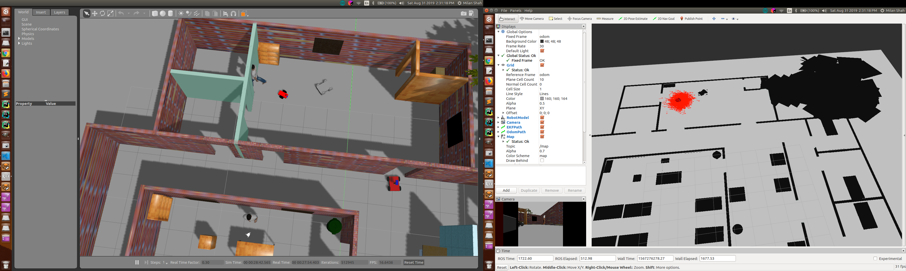

[](https://www.udacity.com/robotics)

# Udacity Nanodegree: Robotics Software Engineer

## Project 03: Where Am I

<p align="center">
    
</p>

### Directory Structure

```
.                                           # Project 03: Where Am I
├── ball_chaser                             # ball_chaser package
│   ├── launch
│   │   └── ball_chaser.launch
│   ├── src
│   │   ├── drive_bot.cpp
│   │   └── process_image.cpp
│   ├── srv
│   │   └── DriveToTarget.srv
│   ├── CMakeLists.txt
│   └── package.xml
├── my_robot                                # my_robot package
│   ├── config
│   │   ├── base_local_planner_params.yaml  
│   │   ├── costmap_common_params.yaml
│   │   ├── global_costmap_params.yaml
│   │   └── local_costmap_params.yaml
│   ├── launch
│   │   ├── amcl.launch
│   │   ├── robot_description.launch
│   │   └── world.launch
│   ├── maps
│   │   ├── MyWorld.pgm
│   │   └── MyWorld.yaml
│   ├── meshes
│   │   └── hokuyo.dae
│   ├── urdf
│   │   ├── my_robot.gazebo
│   │   └── my_robot.xacro
│   ├── worlds
│   │   ├── empty.world
│   │   └── MyWorld.world
│   ├── CMakeLists.txt
│   └── package.xml
├── teleop_twist_keyboard                   # teleop_twist_keyboard package
│   ├── CHANGELOG.rst
│   ├── CMakeLists.txt
│   ├── package.xml
│   ├── README.md
│   └── teleop_twist_keyboard.py
└── CMakeLists.txt -> /opt/ros/kinetic/share/catkin/cmake/toplevel.cmake
```

### How to run

#### 1. First of all, clone this repo:
```
git clone --recursive https://github.com/milan-r-shah/RoboND_Where_Am_I.git
```

#### 2. Launch the robot inside your world
This can be done by launching ```world.launch``` file:
```
$ cd <directory_where_you_have_cloned_the_repo>/RoboND_Go_Chase_It/catkin_ws/
$ catkin_make
$ source devel/setup.bash
$ roslaunch my_robot world.launch
```

#### 3. Launch amcl package
This can be done by launching ```ball_chaser.launch``` file:
```
$ cd <directory_where_you_have_cloned_the_repo>/RoboND_Go_Chase_It/catkin_ws/
$ source devel/setup.bash
$ roslaunch my_robot amcl.launch
```